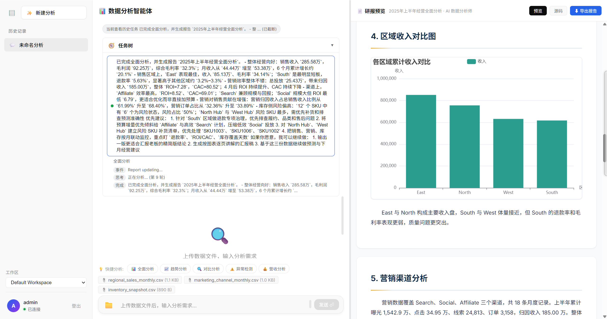

# Open Data Analysis

[中文说明](README.zh-CN.md)

Interactive, Claude-Code-style data analysis for tabular files. Upload CSV or Excel data, let the agent inspect and query it, then generate a report with interactive charts.



## Highlights

- Agent runtime with tool calling and self-directed planning, not a fixed DAG
- Workspace-aware auth, sessions, runs, and file ownership
- Real-time WebSocket execution stream plus resumable run/report state
- Local object storage abstraction with clean migration path to S3-compatible backends
- Vue 3 frontend, Go backend, SQLite metadata + SQLite analysis scratch DB

## Current Architecture

### Runtime Data Layers

1. Metadata SQLite  
   Stores users, workspaces, memberships, sessions, files, and analysis runs.

2. Session analysis SQLite  
   Each session gets its own scratch database for imported CSV/Excel data and SQL analysis.

PostgreSQL is not enabled in runtime yet. The repository keeps the domain boundaries and schema direction ready for a future migration, but the current product uses SQLite in production code paths.

### Storage

The application does not bind business logic to MinIO. Files are addressed by `file_id`, and the backend resolves them through the storage abstraction.

Current default implementation:

- Provider: local filesystem
- Upload object key: `workspaces/{workspace_id}/files/{file_id}/source/{filename}`
- Report object key: `workspaces/{workspace_id}/runs/{run_id}/report/report.html`

### Local Docker Debugging

When started with `docker compose`, the server enables `LLM_DEBUG=true` by default and writes model request/response traces to a separate trace directory:

- Path: `data/llm-debug/`
- Format: `YYYY-MM-DD/<trace_id>/request.json + response.json + index.jsonl`
- Separation: kept outside normal app stdout logs

## Tech Stack

| Layer | Stack |
|---|---|
| Frontend | Vue 3, Vite, Pinia |
| Backend | Go, Chi, Gorilla WebSocket |
| Agent | Tool-calling ReAct loop |
| Data ingestion | CSV / Excel -> SQLite |
| Charts | ECharts 5 |
| Storage | Local object storage abstraction |
| Deployment | Docker, Docker Compose |

## Agentic Direction

The project treats the backend as an agent runtime, not a hidden workflow engine. The system should expose goals, tools, state, and thin guardrails; the model should judge what to do next.

Reference:

- `docs/agentic-principles.md`

Non-goals:

- hardcoded step order
- implicit phase transitions
- runtime-written advice that tells the model how to act

Available core tools:

- `data_load_file`
- `data_list_tables`
- `data_describe_table`
- `data_query_sql`
- `report_create_chart`
- `report_manage_blocks`
- `report_configure_layout`
- `report_finalize`
- `code_run_python`
- `memory_save_fact`
- `state_memory_inspect`
- `state_goal_inspect`
- `state_report_inspect`
- `goal_manage`
- `task_delegate`
- `user_request_input`

Notes:

- `goal_manage` is optional scratchpad state, not a required planning phase
- state inspect tools expose facts only; the model decides how to use them
- durable project guidance lives in `AGENTS.md`, not in the runtime prompt

## Authentication

The backend now runs in authenticated mode. Except for `/api/auth/login` and `/api/health`, APIs require a valid token.

Default admin credentials are configured through environment variables, not hardcoded in business logic.

Example defaults in `server/.env.example`:

```env
DEFAULT_USER_ID=admin
DEFAULT_USER_EMAIL=admin
DEFAULT_USER_NAME=Administrator
DEFAULT_USER_PASSWORD=admin@123
DEFAULT_WORKSPACE_ID=default
DEFAULT_WORKSPACE_NAME=Default Workspace
AUTH_SECRET=change-me
```

## Quick Start

### Docker Compose Only

```bash
# 1. Prepare env
cp server/.env.example server/.env

# 2. Fill in your LLM settings
#    Configure LLM_PROVIDER / LLM_API_KEY / LLM_MODEL and related values

# 3. Start all services
docker compose up -d --build

# 4. Open
#    Visit http://localhost
```

Local setup is intentionally standardized on `docker compose`. The repository does not treat `go run main.go` or `npm run dev` as the primary supported path anymore.

### Rebuild And Logs

```bash
# Rebuild all services from scratch
docker compose up -d --build --force-recreate

# Follow backend logs
docker compose logs -f server

# Follow frontend logs
docker compose logs -f client

# Follow python executor logs
docker compose logs -f python-executor

# Stop all services
docker compose down
```

### Runtime Directories

All runtime data stays under the mounted `data/` directory inside Docker:

- `data/metadata/`: metadata SQLite
- `data/cache/`: per-session analysis SQLite scratch files
- `data/storage/`: uploaded source files and generated report objects
- `data/tmp/`: materialized temp files
- `data/llm-debug/`: LLM request/response traces

LLM debug traces are organized by date and trace ID:

- `data/llm-debug/YYYY-MM-DD/index.jsonl`
- `data/llm-debug/YYYY-MM-DD/<trace_id>/request.json`
- `data/llm-debug/YYYY-MM-DD/<trace_id>/response.json` or `response.error.txt`
- `data/llm-debug/YYYY-MM-DD/<trace_id>/index.jsonl`

## Main API Surface

Authenticated endpoints currently include:

- `POST /api/auth/switch-workspace`
- `GET /api/bootstrap`
- `GET /api/sessions`
- `GET /api/sessions/{sessionID}`
- `GET /api/runs`
- `GET /api/runs/{runID}`
- `GET /api/runs/{runID}/report`
- `POST /api/upload?session_id=...`
- `GET /ws?token=...&session_id=...`

## UI Behavior

- Workspace switch issues a new token and reconnects the WebSocket
- Recent sessions and runs are restored on bootstrap
- Final report HTML can be reopened after refresh
- Uploaded source files remain session-scoped and are not mixed with generated report artifacts

## Project Structure

```text
.
├── client/
│   ├── src/
│   │   ├── components/
│   │   ├── composables/
│   │   └── stores/
│   ├── Dockerfile
│   └── nginx.conf
├── server/
│   ├── agent/
│   ├── auth/
│   ├── config/
│   ├── data/
│   ├── domain/
│   ├── handler/
│   ├── metadata/
│   ├── migrations/
│   ├── repository/
│   ├── service/
│   ├── session/
│   ├── storage/
│   ├── tools/
│   ├── Dockerfile
│   └── main.go
├── data/
├── docker-compose.yml
├── README.md
└── README.zh-CN.md
```

## Product Direction

This repository is being built as a new product, so the priority is reducing future technical debt rather than preserving backward compatibility. Current implementation choices favor explicit boundaries:

- auth and workspace ownership
- session and run lifecycle
- file identity and storage abstraction
- report persistence and recovery

## License

MIT — see [LICENSE](LICENSE) for details.
