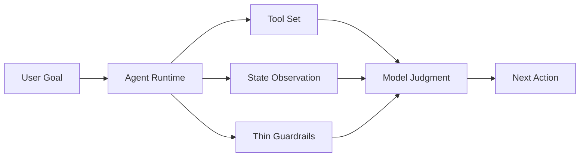

Many AI Agent projects eventually drift into a familiar shape: they appear autonomous on the surface, but internally they have already become hidden workflows. The model seems to be "thinking," yet the real decisions about order, phases, and when to finish are still encoded in backend logic.

We felt this very clearly while building a data analysis agent. The agent could load CSV / Excel files, inspect schema, execute SQL, generate charts, organize report blocks, maintain working memory, track goals, inspect report state, and run constrained delegation. After the project reached a certain level of complexity, we realized the most valuable thing to extract was not any single tool, but a set of practices around **how an Agent Runtime should be designed**.

These 7 lessons are the ones that survived repeated implementation mistakes and refactors.

## 1. Do Not Turn an Agent into "A Workflow That Can Call Tools"

Many systems start with a seemingly reasonable sequence:

1. Read the user request
2. Load the data
3. Inspect the schema
4. Write SQL
5. Generate charts
6. Finalize the report

That sequence is fine for a demo, but once tasks become more complex, a fixed path becomes a constraint. In real work, the model may need to explore relationships across tables before deciding the analytical framing. It may need to persist a few confirmed facts before diving deeper. Some problems should be delegated early rather than forcing the main agent to keep carrying more context.

Our eventual conclusion was this: **the system should provide goals, tools, state, and boundaries, but it should not predefine the path.**

In other words, the backend should behave like a runtime, not a workflow engine. It should tell the model what it can see, what it can do, and which outputs are not allowed to land, but it should not secretly encode what the next step ought to be.

This sounds like a subtle wording difference, but in practice it changes the entire direction of the system.

## 2. The System Should Expose State, Not Make Decisions for the Model

One of the easiest ways an agent system becomes too heavy is when the runtime starts taking over judgment. As soon as the model performs poorly in one area, engineers are tempted to patch in suggestions like:

- "The evidence is insufficient, continue analysis"
- "You should delegate now"
- "Do not write the report yet, add charts first"

Those rules do help in the short term, but over time they push the system back toward conventional orchestration.

We intentionally converted this kind of logic into **state exposure** instead. For example:

- `state_memory_inspect` only returns the current working memory facts
- `state_goal_inspect` only returns the goal tree, status distribution, and active branches
- `state_report_inspect` only returns blocks, charts, and reference integrity

All of these tools do the same thing: they expose facts. Whether those facts imply "keep investigating" or "you can now finish" is still left to the model.

This separation matters a lot. **Judgment belongs to the model; state belongs to the runtime.** Once those two are blended together, the system slowly becomes "code thinks, model executes."

## 3. Observation Tools Are Often More Important Than Action Tools

When people design agents, they usually start with action tools:

- query a database
- execute SQL
- run Python
- create a chart
- write report content

Those are important, but in our experience the tools that define the upper bound of an agent are often the observation tools.

Because in long-running tasks, the most common problem is not "the model cannot act." It is "the model no longer knows what state it is in." It may forget that a column meaning was already confirmed earlier, forget that a goal has already been resolved, or fail to notice that a chart has not actually been referenced from the report body.

We gradually started prioritizing a class of tools that do not perform work, but only return state. Their value is that they let the model actively observe the world when needed, instead of forcing the runtime to inject a large block of state into every turn.

The impact was immediate:

- cleaner context, because state becomes pull-based
- more autonomy, because observation itself becomes an action
- a more disciplined runtime, because it no longer nudges the reasoning path implicitly

If you are building agents, it is often better to add observation tools before adding more prompt rules.

## 4. Structured State Is Useful, But It Must Not Become a Phase Machine

We implemented several kinds of structured runtime state:

- Working Memory
- Subgoal Tree
- Report Block Tree

These structures are genuinely useful. They make intermediate state observable and make later validation easier. But they also introduce a subtle risk: once structured state becomes too central, it starts dictating the model's reasoning order.

For example:

- `goal_manage` can easily become "the model must plan before acting"
- a report block tree can quietly turn into "outline first, fill section by section, finalize at the end"

That is just a phase machine in disguise.

We ended up setting a very explicit rule for ourselves: **structured state is optional scaffolding, not a mandatory thinking path.** The model may use subgoals to externalize decomposition, may store stable facts in working memory, or may continue exploring directly. The runtime should never assume that because a structure exists, the model must follow a fixed sequence around it.

Structure can stabilize a system, but it must not take over the system's cognition.

## 5. Guardrails Must Stay Thin, But They Must Be Hard

"Do not make decisions for the model" does not mean "do not enforce anything." A production-worthy agent absolutely needs guardrails. The key is that the role of guardrails must remain very clear: **block invalid outcomes, do not orchestrate the normal path.**

In our data analysis agent, `report_finalize` is a good example. We did not let the runtime decide when the model should write conclusions or add charts, but we did enforce hard checks before finalization:

- whether the goal tree still contains unresolved active branches
- whether report blocks contain duplicated headings
- whether chart blocks are missing captions
- whether referenced chart IDs actually exist

If those conditions are not satisfied, finalization is rejected.

The important distinction is this: the runtime says "this output cannot land yet," but it does not say "you must do A and then B." Many agent systems do not fail because they have too many guardrails. They fail because guardrails quietly evolve into process orchestration.

## 6. In Long Tasks, Fix Context First Before Blaming the Model

Short tasks hide many agent problems. Long tasks expose them quickly. And once they do, the main bottleneck is often not model capability, but context management.

Our traces showed a very recognizable pattern:

- chart tools feeding entire ECharts options back into history
- report tools appending large blocks of prose into the prompt repeatedly
- query results being preserved too literally, reducing the ratio of useful information late in the run

The end result is not that "the model suddenly became less intelligent." It is that the prompt is gradually filled with low-value history.

So our later work shifted away from adding more system-prompt rules and toward context control:

- compact tool-call history so only future-relevant summaries remain
- let the model persist key conclusions into working memory
- compress older history into digests once token pressure rises
- move runtime state to pull-based observation tools

These changes are not as flashy as switching models, but they often have a larger impact on stability. A surprising number of "reasoning problems" are actually context engineering problems.

## 7. Delegation Is a Boundary Tool, Not a Performance Feature

Multi-agent systems are easy to turn into theater. As soon as the task looks hard, people spawn more agents so the system appears more sophisticated. But without strict boundaries, delegation amplifies complexity more than capability.

Our core rule for `task_delegate` was simple: **delegation is only worth using when the subtask boundary is clear and the allowed tool set can be sharply restricted.**

That means a child agent is not "a second main agent with more freedom." It is a constrained execution unit. You should know:

- the exact problem it is supposed to solve
- which tools it is allowed to use
- how its result flows back into the parent

If those boundaries are vague, delegation does not create parallelism benefits. It creates state sprawl, tool misuse, and a much harder debugging story.

In practice, we came to see delegation less as a concurrency feature and more as a capability-boundary mechanism.

## Conclusion

If these 7 lessons had to be compressed into one sentence, it would be this:

**The most important job of an Agent Runtime is not to design the path for the model, but to get state, tools, boundaries, and context management right.**

A good agent system should:

- give the model a clear goal
- provide tools with explicit boundaries
- expose state on demand
- use thin guardrails to block invalid outcomes
- continuously manage long-task context growth
- rely on traces to debug reality instead of tuning prompts by instinct

Once those foundations are solid, model autonomy starts turning into genuine capability. Without them, even a sophisticated prompt is usually just another form of workflow.
