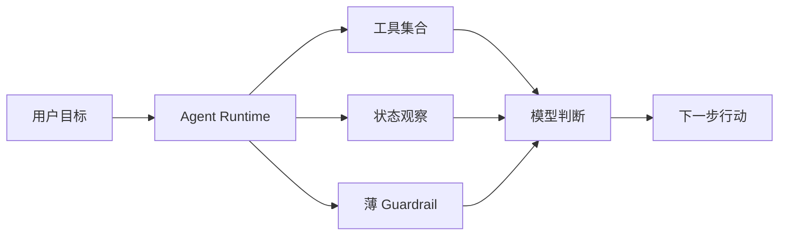

很多 AI Agent 项目做着做着，最后都会变成一种熟悉的形态：表面上支持自主决策，实际内部已经被写成了一条隐藏工作流。模型看起来在“思考”，但真正决定顺序、阶段和收尾时机的，往往还是后端代码。

我们在做一个数据分析智能体时，对这个问题体会很深。这个 Agent 能加载 CSV / Excel、查看 schema、执行 SQL、生成图表、组织报告，还支持工作记忆、目标树、报告状态和受限委派。项目推进到中段之后，我们逐渐意识到，最值得沉淀的并不是某个具体工具，而是几条关于 **Agent Runtime 应该怎么设计** 的实践。

下面这 7 条，是我们反复踩坑之后留下来的真正经验。

## 1. 不要把 Agent 做成“会调用工具的 Workflow”

很多系统一开始就会预设一个合理流程：

1. 读取用户需求
2. 导入文件
3. 查看表结构
4. 写 SQL
5. 画图
6. 生成报告

这个顺序在 demo 阶段没有问题，但一旦任务变复杂，固定路径就会变成限制。真实任务里，模型可能需要先探索多个表的关系，再决定分析口径；也可能先记录几个已经确认的事实，再继续下钻；有些问题甚至应该先委派出去，而不是继续在主线程里堆上下文。

我们后来的收敛是：**系统只提供目标、工具、状态和边界，不替模型预设路径。**

换句话说，后端更像 runtime，而不是 workflow engine。它负责告诉模型“你现在能看到什么、能做什么、哪些结果不能落地”，但不负责把“下一步应该做什么”偷偷编码进去。

这个变化听上去像表述差异，实际上是整个系统演化方向的分水岭。

## 2. 系统提供状态，不替模型下判断

Agent 最容易“越做越重”的地方，是 runtime 开始承担判断责任。模型一旦某个地方做得不好，工程师就会忍不住补一段提示：

- “这里证据不够，建议继续分析”
- “你应该先 delegate”
- “现在不要写报告，先补图表”

短期看，这些规则确实能止血；长期看，它们会把系统一点点推回传统流程编排。

我们后来刻意把这类逻辑改成 **状态暴露**。例如：

- `state_memory_inspect` 只返回当前工作记忆里的事实
- `state_goal_inspect` 只返回目标树、状态分布和 active branch
- `state_report_inspect` 只返回 block、chart 和引用关系

这几个工具都只做一件事：把事实说清楚。至于这些事实意味着“继续查证”还是“可以收尾”，由模型自己判断。

这是一个很重要的分工。**Judge 属于模型，State 属于 runtime。** 一旦混起来，系统就会越来越像“代码在思考，模型在执行”。

## 3. Observation Tool 往往比 Action Tool 更重要

大多数人在设计 agent 时，首先想到的是 action tool：

- 查数据库
- 跑 SQL
- 执行 Python
- 生成图表
- 写报告

这些当然重要，但真正决定 agent 上限的，往往是 observation tool。

因为长任务里最常见的问题不是“模型不能行动”，而是“模型不知道自己当前处于什么状态”。它可能忘了之前已经确认过某个字段含义，忘了某个目标已经完成，或者不知道报告里某张图实际上还没有被正文引用。

我们后来越来越重视一类工具：不执行任务，只返回状态。这类工具的价值在于，它们让模型能在需要的时候主动观察世界，而不是被 runtime 每轮强行灌输一大段状态文本。

实际效果非常明显：

- 上下文更干净，因为状态变成按需拉取
- 模型更自主，因为“观察”本身也是行动
- runtime 更克制，因为它不再暗中引导推理方向

如果你正在做 Agent，建议优先补 observation tool，而不是继续堆 prompt。

## 4. 结构化状态可以有，但不要把它们做成阶段机

我们在运行时里实现了几类结构化状态：

- Working Memory
- Subgoal Tree
- Report Block Tree

这些结构非常有用。它们能让中间状态更可观察，也能支持后续校验和持久化。但我们很快也遇到了一个风险：一旦结构化状态被过度依赖，它们就会反过来规定模型的推理顺序。

例如：

- `goal_manage` 很容易被误用成“必须先规划再行动”
- 报告 block tree 很容易变成“先列大纲、再分段填充、最后统一收尾”

这其实是在把 Agent 重新做成阶段机。

我们后来给自己的约束很明确：**结构化状态是可选脚手架，不是默认思维路径。** 模型可以使用 subgoal 来记录问题拆解，可以写 working memory 来沉淀口径，也可以直接继续探索。runtime 不应该因为这些结构存在，就要求模型必须遵循某种固定顺序。

结构能帮助系统稳定，但不能接管系统的思考方式。

## 5. Guardrail 要薄，但必须足够硬

“不要替模型做判断”不代表“不要任何约束”。真正可用的 Agent，一定需要 guardrail，只是 guardrail 的职责必须非常清楚：**阻止坏结果落地，而不是规划正常过程。**

在我们的数据分析 Agent 里，`report_finalize` 是一个典型例子。我们没有让 runtime 决定什么时候应该写结论、什么时候应该补图，但我们会在最终收尾前做硬校验：

- 目标树里是否仍有未闭环的 active branch
- 报告 block 是否存在重复标题
- 图表是否缺 caption
- 文中引用的图表 ID 是否真实存在

如果这些条件不满足，收尾会被拒绝。

这里的关键是：runtime 只说“现在还不能落地这个结果”，但不说“你必须先执行 A，再执行 B”。这个边界非常重要。很多系统的问题并不是 guardrail 太多，而是 guardrail 不知不觉开始扮演流程编排器。

## 6. 长任务里，先治理上下文，再责怪模型

Agent 跑短任务时，很多问题不明显；一旦进入长任务，真正的瓶颈往往不是模型能力，而是上下文管理。

我们在 trace 里看到过很典型的问题：

- 图表工具把完整 ECharts option 回灌进历史
- 报告工具把大段正文一轮轮叠加进 prompt
- 查询结果保留太完整，导致后半程有效信息占比越来越低

最后的结果不是“模型突然变笨了”，而是 prompt 里低价值历史越来越多。

所以我们后来的重点，不是继续往 system prompt 里加规则，而是做上下文治理：

- 对历史工具调用做压缩，只保留后续推理真正需要的摘要
- 让模型主动把关键结论写进 working memory
- 超过阈值后，把更早历史折叠成 digest
- 把状态改成 observation tool 按需拉取

这类优化没有换模型那么显眼，但它们对 agent 稳定性的影响通常更大。很多“推理问题”，最后本质上都是上下文工程问题。

## 7. Delegate 是边界工具，不是炫技功能

多智能体很容易被做成表演系统：任务一复杂，就拆出很多子 agent，让系统看起来“很聪明”。但如果没有严格边界，delegate 很快就会放大复杂度，而不是放大能力。

我们对 `task_delegate` 的一个核心约束是：**只有当子任务边界清晰，而且允许工具列表可以被明确裁剪时，delegate 才值得使用。**

这意味着子代理不是“第二个更自由的主代理”，而是一个受限执行单元。你必须清楚：

- 它要解决的具体问题是什么
- 它允许使用哪些工具
- 它的产出会如何回流到主代理

如果这些边界不清楚，delegate 带来的不是并行收益，而是状态扩散、工具误用和调试难度激增。

所以在我们的实践里，delegate 更像权限边界工具，而不是炫技式的多线程展示。

## 结语

如果要把这 7 条经验压缩成一句话，那就是：

**Agent Runtime 最重要的，不是替模型设计路径，而是把状态、工具、边界和上下文管理做对。**

好的 agent 系统应该做到这些事：

- 给模型足够清晰的目标
- 提供边界明确的工具
- 暴露按需可观察的状态
- 用薄 guardrail 拦住非法结果
- 持续治理长任务上下文
- 用 trace 审计真实问题，而不是凭感觉调 prompt

一旦这些基础打稳，模型的自主性才会真正变成能力；否则，再复杂的 prompt，也只是另一种形态的 workflow。
